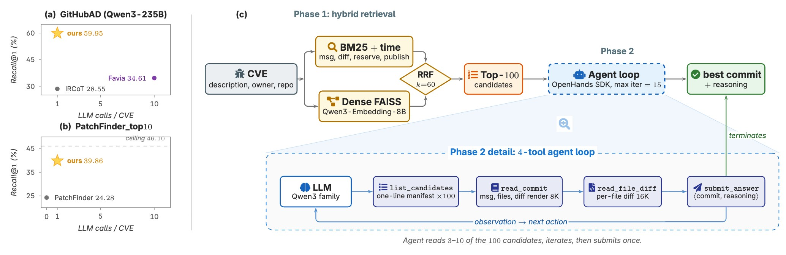

# PatchHolmes

**Large-scale CVE → fix-commit tracing via hybrid retrieval and an agentic loop.**



- **Phase 1.** BM25 + time-decay and dense (Qwen3-Embedding) fused via RRF → Top-100.
- **Phase 2.** OpenHands-SDK agent reads candidates with custom tools, picks one `commit_id`.

All quantitative results are reported in the paper.

---

## Install

```bash
cd PatchHolmes
pip install -e .
pip install -r requirements.txt
cp .env.example .env    # set PATCHHOLMES_LLM_API_KEY (or point at a local vLLM endpoint)
```

Python ≥ 3.10. GPU required for Phase 1 encoding; Phase 2 needs an LLM endpoint.

---

## Quick start (CPU, 1 minute)

`data/mini/` ships 6 small repos / 7 CVE with pre-computed BM25 + Qwen3 features.

```bash
# Phase 1
python -m patchholmes.cli.phase1 \
    --dataset           data/mini/ground_truth.csv \
    --feature-root      data/mini/embeddings \
    --repo2commits-root data/mini/repos \
    --embedding-root    data/mini/embeddings \
    --dense-top-k       5000 --rrf-top-k 100 \
    --per-query-output  /tmp/mini_phase1.jsonl

# Phase 2 (set one LLM endpoint first)
export PATCHHOLMES_LLM_MODEL=openrouter/qwen/qwen3-235b-a22b-2507
export PATCHHOLMES_LLM_BASE_URL=https://openrouter.ai/api/v1
export PATCHHOLMES_LLM_API_KEY=<your-key>
# or local vLLM:
# export PATCHHOLMES_LLM_MODEL=hosted_vllm/qwen3-235b
# export PATCHHOLMES_LLM_BASE_URL=http://localhost:8000/v1
# export PATCHHOLMES_LLM_API_KEY=EMPTY

python scripts/run_phase2_full.py \
    --phase1-jsonl /tmp/mini_phase1.jsonl \
    --dataset-csv  data/mini/ground_truth.csv \
    --repo2commits data/mini/repos \
    --output       /tmp/mini_phase2.jsonl --num-workers 4

# Eval (Hit@1, Recall@K, MRR, cost)
python -m patchholmes.cli.eval_phase2 /tmp/mini_phase2.jsonl --phase1 /tmp/mini_phase1.jsonl
```

---

## Reproduce paper experiments

### Main IR comparison (`sample_810`)

```bash
scripts/patchholmes.sh phase1 \
    --dataset           ./data/sample_ground_truth_810.csv \
    --feature-root      ./embeddings \
    --repo2commits-root ./data/repo2commits_diff \
    --embedding-root    ./embeddings \
    --dense-top-k 5000 --rrf-top-k 100 \
    --per-query-output  ./logs/phase1_810.jsonl

python scripts/run_phase2_full.py \
    --phase1-jsonl ./logs/phase1_810.jsonl \
    --dataset-csv  ./data/ground_truth_queries_clean.csv \
    --repo2commits ./data/repo2commits_diff \
    --output       ./logs/phase2_810.jsonl --num-workers 8

python scripts/eval_methods.py \
    --method patchholmes:./logs/phase2_810.jsonl \
    --method ircot:./logs/ircot/*.jsonl \
    --method favia:./logs/favia/results.jsonl \
    --denominator full \
    --patchholmes-extend-phase1 ./logs/phase1_810.jsonl
```

### Ablations

**A / B / C — single-leg Phase 1**

```bash
for R in bm25 bm25_time dense; do
  python ablation/phase1_retrievers/make_phase1_jsonl.py \
      --retriever $R --queries-csv ./data/sample_ground_truth_810.csv \
      --feature-root ./embeddings --top-k 100 \
      --output ./logs/phase1/ablation_${R}_810.jsonl

  python scripts/run_phase2_full.py \
      --phase1-jsonl ./logs/phase1/ablation_${R}_810.jsonl \
      --dataset-csv  ./data/ground_truth_queries_clean.csv \
      --output ./logs/phase2/ablation/${R}/results.jsonl --num-workers 64
done
```

**D — full NVD markdown as Phase 2 input** (`data/cve_report_810.csv` shipped)

```bash
python scripts/run_phase2_full.py \
    --phase1-jsonl ./logs/phase1_810.jsonl \
    --dataset-csv  ./data/cve_report_810.csv \
    --output ./logs/phase2/ablation/cve_report/results.jsonl --num-workers 64
```
**Dense-backbone swap → [`Octen-Embedding-8B`](https://huggingface.co/Octen/Octen-Embedding-8B)**

```bash
bash ablation/phase1_dense_model/encode_with_octen.sh

python ablation/phase1_dense_model/make_phase1_octen.py \
    --queries-csv ./data/sample_ground_truth_810.csv \
    --feature-root ./embeddings --dense-subdir octen_embedding \
    --top-k 100 --output ./logs/phase1/ablation_octen_810.jsonl

# Optional robustness: Octen's own training-time prompt
python ablation/phase1_dense_model/reencode_queries_octen.py
python ablation/phase1_dense_model/make_phase1_octen.py \
    --queries-csv ./data/sample_ground_truth_810.csv \
    --feature-root ./embeddings --dense-subdir octen_embedding \
    --queries-name queries_octen_official.pkl \
    --top-k 100 --output ./logs/phase1/ablation_octen_official_810.jsonl
```

### Supplementary experiments

`ablation/` also holds the paper's supplementary studies — tool-interface
ablation, cross-model-family generalization, efficiency/cost, statistical
significance, and same-pool Favia / IRCoT comparisons. See
[`ablation/README.md`](ablation/README.md) for what each measures and its inputs.

### PatchFinder_top10 (Favia's 1,252-CVE benchmark)

```bash
python -m baselines.patchfinder_top10.run \
    --variant PatchFinder_top10 \
    --output ./logs/patchholmes_patchfinder.jsonl --num-workers 8

python -m baselines.patchfinder_top10.eval \
    ./logs/patchholmes_patchfinder.jsonl \
    --summary-out ./logs/patchholmes_patchfinder.summary.json
```

Dataset: [`andstor/cvevc_candidates`](https://huggingface.co/datasets/andstor/cvevc_candidates).

### External baselines (not bundled)

- **IRCoT** (Trivedi et al., ACL 2023) — via [FlashRAG](https://github.com/RUC-NLPIR/FlashRAG).
- **Favia** (Storhaug & Wang, 2025) — original authors' release;
  datasets at [`andstor/cvevc_candidates`](https://huggingface.co/datasets/andstor/cvevc_candidates)
  and [`andstor/favia_trajectories`](https://huggingface.co/datasets/andstor/favia_trajectories).

Feed each per-CVE jsonl to `scripts/eval_methods.py` for comparable IR metrics.

---

## Layout

```
patchholmes/               core (encoding, phase1, phase2, eval, cli)
ablation/                  Phase-1/2 ablations + supplementary experiments (see ablation/README.md)
baselines/patchfinder_top10/   adapter for Favia's benchmark
scripts/                   patchholmes.sh, run_phase2_full.py, eval_methods.py, ...
data/
├── ground_truth_queries_clean.csv     8,401 CVE
├── sample_ground_truth_810.csv        809-CVE evaluation sample
├── cve_report_810.csv                 NVD markdown reports (ablation D)
└── mini/                              ~8 MB minimum verifiable dataset
```

Full per-repo commit corpus + embeddings (~30+ GB) are not bundled — regenerate by:
1. Cloning each repo in `ground_truth_queries_clean.csv` and exporting commits as JSON.
2. `scripts/patchholmes.sh encode corpus` — needs a GPU and Tevatron
   (`pip install "tevatron @ git+https://github.com/texttron/tevatron.git"`); uses `Qwen/Qwen3-Embedding-8B`.
3. Building BM25+time via Elasticsearch on the per-repo JSON (or `patchholmes.phase1.es_bm25_online`).

CVE descriptions are queryable from the [NVD API](https://nvd.nist.gov/developers/vulnerabilities).

---

## License

MIT (code). NVD metadata is public domain. External baselines (OpenHands SDK, FlashRAG, Favia) install from upstream.
